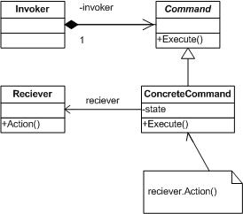

#Command pattern

+ Intuitive definition: wrap an action(may consist of many other methods) and the information it needs to execute in an object type
+ Scenario of use: when we want to perform a sequence of tasks, but need to prioritize, skip, undo, or do other manipulations(that are normally typical for objects) with actions
+ Benefits:
	- decouples command sender from the objects needed to execute a command
	- commands can be manipulated as object(i.e. sorted, grouped, skipped, queued, kept in stack, etc)
	- can be ordered in composite structure
	- provide a simple way for the client to execute an action
	- easy to add new commands(just add new classes, without modifying existing code)
	- allows support of undoable operations
	- commands can be executed asynchrounously
+ Cons:
	- can lead to a large number of objects

+ [Concrete implementation in a project](https://github.com/Baloons-Pop-4/Main/tree/master/src/BalloonsPop.Engine/Commands)

+ Diagram:
	
