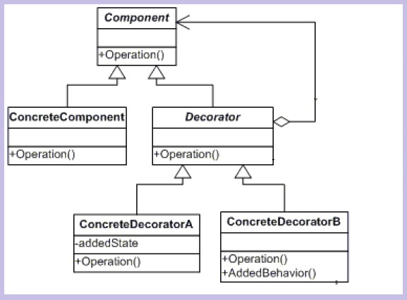

#Decorator Pattern

+ Intuitive definition: wrapper classes that allow the addition of responsibilities and functionalities to object at execution time.
+ Scenario of use: when it is more convinient to add functionality to a certain instance of a type than extending an existing type
+ Benefits:
  - prevents class explosions(allows composition of decorators, instead of creating an exponential number of derived classes)
  - doesn't break the open/closed principle(allows new functionality to be added without changing existing code)
  - allows extention of existing code without recompiling the existing code(via dependency injections)
  - 
+ Cons:
  - raises code complexity
  - it's hard to track long chains of decorator compositions
  
+ Diagram:

