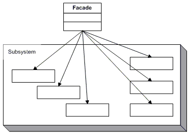

#Facade Pattern

+ Intuitive definition: a piece of code that provides a simpler/better way to use existing code that is badly/poorly designed
+ Scenario of use: when a simpler, more intuitive interface to a body of code is needed
+ Benefits:
	- simplifies usage of existing code by:
		- making the code more intuitive
		- reducing code volume
		- improving readability
		- improving cohesion by dividing responsibilities
		- improving coupling by inverting dependencies
		- providing customizible layers of abstraction
	- allows a way to improve the usage of 3d party code 
+ Cons:
	- usually hides poorly designed code(that code might need refactoring, instead of a facade)

+ Diagram:

+ Real world example:
	- My [Businessman implementation](./Businessman.cs) exposes a lot of public methods(WakeUp, HaveBreakfast, DriveToWork, etc), which are inconvinient to use in that form. That functionality can be wrapped inside a [facade](./BusinessmanFacade.cs) that lets the client use the base methods in a shorter and simpler way
	- Javascript's splice and slice can do a lot of things in the same time: add, remove, insert, shallow clone, deep clone, etc. A [facade](./array-operations-facade.js) for splice and slice could be implemented, that makes the use of the methods' functionality more self-documenting and intuitive